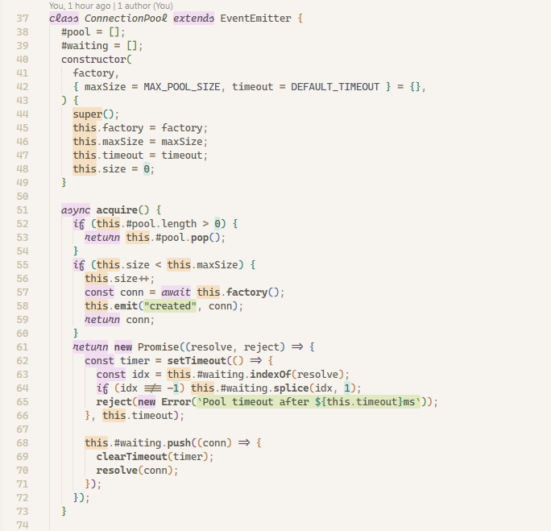
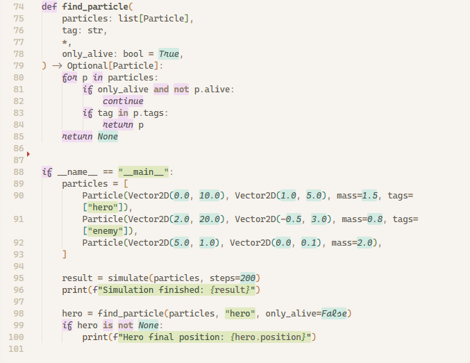
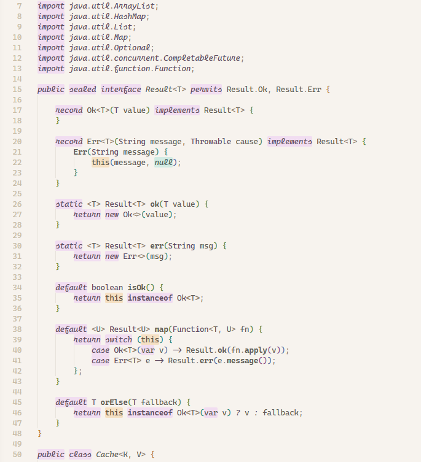

### A warm, minimal light theme for Visual Studio Code

Most syntax themes color your code by changing text color. Flatwhite does something different: it highlights keywords, strings, and constants with **colored backgrounds**, the way you'd mark up a printed page with a highlighter pen. The result is a calm, readable editor where structure jumps out without ever feeling aggressive, while keeping a constant 6:1 contrast between text and background colors.

Ported from one of my fav. ❤️ themes for Atom ([link](https://github.com/biletskyy/flatwhite-syntax)).

---

## Preview

### Js



### Python



### Java

## 

---

## Installation

### From the VS Code Marketplace

1. Open the Extensions panel (`Ctrl+Shift+X`)
2. Search for **Flatwhite**
3. Click **Install**
4. Open the Command Palette (`Ctrl+Shift+P`) → **Preferences: Color Theme** → **Flatwhite**

### From source

```sh
git clone https://github.com/<your-username>/flatwhite-theme
```

Open the cloned folder in VS Code and press **F5** — this launches an Extension Development Host window with the theme already active.

---

## Color palette

All colors are derived from the original `flatwhite-syntax` palette.

| Role              | Hex                         |
| ----------------- | --------------------------- |
| Editor background | `#F7F3EE`                   |
| Base text         | `#605A52`                   |
| Comments          | `#B9A992`                   |
| Purple marker     | `rgba(206, 92, 255, 0.15)`  |
| Green marker      | `rgba(132, 189, 0, 0.19)`   |
| Teal marker       | `rgba(0, 189, 163, 0.15)`   |
| Blue marker       | `rgba(117, 163, 255, 0.20)` |
| Orange marker     | `rgba(240, 140, 0, 0.18)`   |
| UI accent         | `#7A4E8A`                   |

---

## Credits

Original design and color palette by **Dmytro Biletskyy** — [flatwhite-syntax](https://github.com/biletskyy/flatwhite-syntax) for Atom.

This port recreates the marker-highlight concept in VS Code using the `TextEditorDecorationType` API (since VS Code's theme engine does not render `background` in `tokenColors`).

---

## License

MIT
